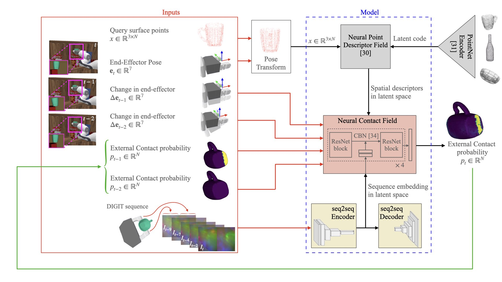
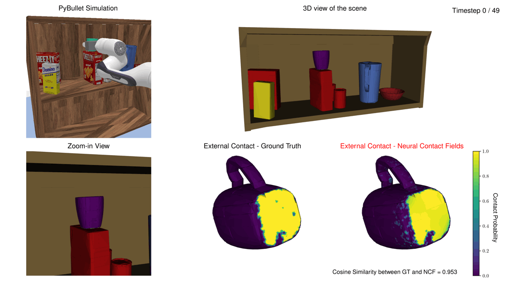

# Neural Contact Fields (NCF)

<p align="center">
    <a href="https://arxiv.org/abs/2210.09297">Paper</a> |
    <a href="https://youtu.be/krIpzZrWQLM">Video</a>
</p>


Neural Contact Fields are an implicit representation for tracking extrinsic contact on an object surface (between object and environment) with vision-based tactile sensing (between robot hand and object).

This repo contains the implementation for our paper: **Neural Contact Fields: Tracking Extrinsic Contact with Tactile Sensing**

<p align="center">

</p>
Our model outputs extrinsic contact probability at the current timestep for a set of query points on the 3D surface of the object. This is done by taking a history of end-effector poses, tactile images and extrinsic contact probabilities as inputs.

-----

## Setup

Clone this repo and create virtual environment to install all dependencies:

```
  git clone https://github.com/carolinahiguera/NCF.git
  cd NCF
  conda create --name ncf --file requirements.txt
  conda activate ncf
```

## Quickstart Demo

Please, run the following scripts for downloading some objects (mugs, bottles, bowls) and trajectories for a demo:

```
  . download_demo_test_objects.sh
  . download_demo_trajectories.sh
```

The first script will download the object assets (.obj and .urdf files) in `./data_collection/objects/test/`. The second script will download three trajectories for testing in `./data_collection/test_data/`.

For running a demo of our pipeline for tracking extrinsic contact:

```
  cd ncf
  python test_ncf.py
```

This will save in `./ncf/results/0_1_0/` screenshots for each timestep of trajectory with an unseen mug. Each image shows:

- The PyBullet simulation frame
- The 3D view o fthe scene
- A zoom-in view of the object
- The extenal contact ground truth
- The NCF external contact prediction

As results, you will get the following screenshots for each timestep of the demo trajectory with an unseen mug:

<p align="center">

</p>

Each image shows Pybullet frame, 3D view of the scene, zoom-in view of the contact interaction, extrinsic contact ground truth probabilities and Neural Contact Fields prediction with the MSE between the ground truth and estimated extrinsic contact probabilities for the trajectory over time. 


## Data Generation

Place the object data assets (.obj and .urdf files) that will be used for training in `./data_collection/objects/train/` and those for testing in `./data_collection/objects/test/`.

A demo of those assests can be downloaded with the following scripts:

```
  . download_demo_train_objects.sh
  . download_demo_test_objects.sh
```

To generate the train and test data, run:

```
  cd ./data_collection 
  python collect_train_data.py 
  python collect_test data.py 
```

The first script will save the train data in `./data_collection/train_data/` and the second one in `./data_collection/test_data/`

The collected data follows the nomenclature x_y_z.py, where:

- x is the object category: mugs (0), bottles (1) and bowls (2)
- y is the object id
- z is the data index

So, for example, the data 0_1_0.py corresponds to the trajectory 0 collected with the mug 1. The data 2_3_10.py corresponds to the trajectory 10 collected with the bowl 3, and so on.

## Training

After generating the training data, run the following script to train the DIGIT seq2seq autoencoder:

```
  cd ncf
  python train_seq2seq.py
```

Then, run the following script to train the NCF model:

```
  python train_ncf.py
```

In `./ncf/train.py` you can set some NCF parameters, such as:

- Number of query points
- Number of points in the point cloud to generate the spatial descriptors
- Dimension of the latent code for the DIGIT sequence
- Batch size

## Citing
If you use this paper for your research or find this code useful, please cite our paper:
@article{higuera2022neural,
      title={Neural Contact Fields: Tracking Extrinsic Contact with Tactile Sensing}, 
      author={Carolina Higuera and Siyuan Dong and Byron Boots and Mustafa Mukadam},
      journal={arXiv preprint arXiv:2210.09297},
      year={2022}
}

## Acknowledgements

We use the implementation provided in the [neural descriptor fields repo](https://github.com/anthonysimeonov/ndf_robot). Also, some parts of this code are based on the implementation found in the [occupancy networks repo](https://github.com/autonomousvision/occupancy_networks). We encourage you to check out those projects!
